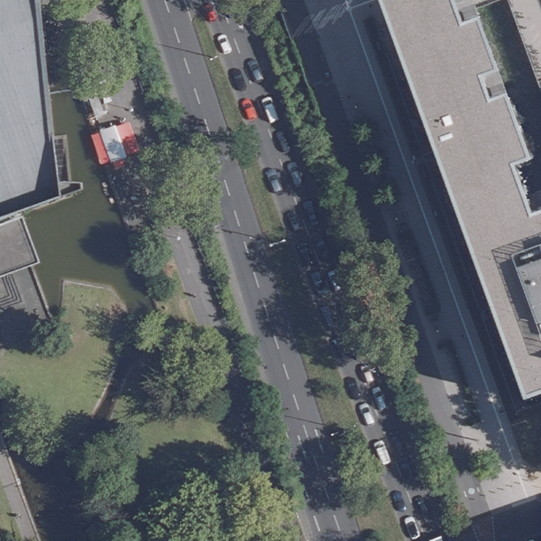
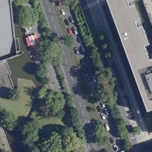
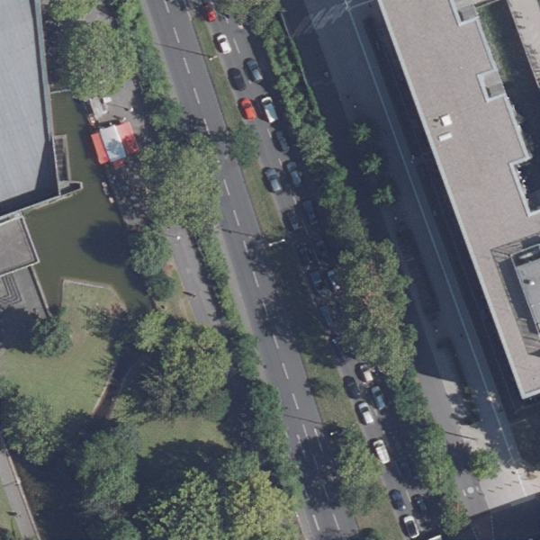
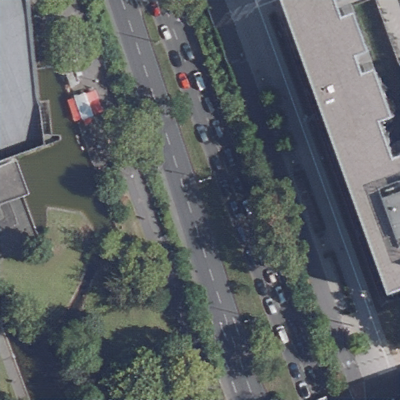
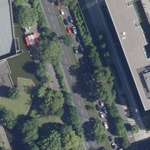
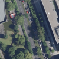

# single-image-SRGAN
Enhance low resolution single images with super-resolution GAN (scaled 4x).    

This implementation is quite similar to the basic principles you'll find here:    
https://github.com/krasserm/super-resolution    
(I also recommend to take a look at: https://github.com/MathiasGruber/SRGAN-Keras)    

You will find more useful links in the top comment section of srgan.py.

The stored (trained) model (/model/image_generator_model.h5) aims to improve aerial photographs, but since this is an universal approach, you can train your own model on image types you intend to improve.  


### Examples
Both input and output images are resized to 600x600 pixel (for comparison).    

Resolution of input image  |  Input images             |  Output images
:-------------------------:|:-------------------------:|:-------------------------:
400x400 pixel              | |  
300x300 pixel              | |  
200x200 pixel              | |  
150x150 pixel              | |  
100x100 pixel              | |  


Comaprison of generated image from input 400x400 pixel and original image (Both resized to 600x600 pixel from 1600x1600 pixel).    

Generated  |  Original        
:-------------------------:|:-------------------------:
 | 


**Training of /model/image_generator_model.h5:**   
- high res images: 1600x1600 pixel
- high res image crops: 96x96 pixel
- low res images: high res crops scaled down by factor 4 (24x24 pixel)
- Pretaining (generator only): 400000 training steps
- Training (generator and discriminator): 600000 training steps


### Usage
Install environment and change into shell
```
$ pipenv install
```
```
$ pipenv shell
```
(Leave shell with "exit".)    

Change into directory /src.    

There are 3 files:
- data_loader.py: loads batches of image crops or a single image
- srgan.py: models and training
- inference.py: an example on how to predict images
    

Use inference.py to enhance aerial images with the generator model in /models (change the script accordingly to your needs).    

If you like to train your own image types
- change the high-res image path (global variable BASE_PATH) in data_loader.py
- define the global variables (i.e. paths) in srgan.py accordingly to your needs
- pre-train the model (train generator, only)
- train the model (train both generator and discriminator)


### Some remarks about the functionality
#### data_loader.py
In fact, it's quite important to know what goes in and what goes out. In this implementation, I assume that I work with quite big images (in fact, the ones I use are 1600x1600 pixel, loaded and stored in RGB mode), which I can divide beforehand into smaller ones in order to reduce computation time **during** training.    
(Meaning: I want the time consuming stuff out of my way during the model training.)    
    
Since the model is working with image crops anyways (here, I chose 96x96 pixel, but that's up to you) I expand the training set by theoretically using each image divide. (Some implementations i.e. use only the upper left area of each image.)    
The "pre-crops" are 2 times bigger than the defined crop size (plus border). This takes the augmentation into account when i.e. after rotation the areas at the image borders must be filled.    
(The filling_mode is set to "reflect" which basically mirrors pixels into the empty areas, but, well, I want to stick with the original pixels as close as possible.)    
    
Augmentation on such small images is fast, hence it's fine to call augmentation of a random (crop) image batch on each training step.    
    
Example calculation:
- (i.e.) 200 images with 1600x1600 pixel
- cop size 96x96 pixel -> "pre-crop" size: 212x212 pixel
- 7*7 -> 49 "pre-crops" per image
- 49 * 200 -> 9800 train images (crops) for this image set
    

If you take the additional augmentation into account then this should be sufficiant training data for a proper training. (Assuming that the actual content of the image crops is balanced well enough.)    
    
The steps are as followed:
- load a defined number of high res images
- divide each high res images in single crops: 2x (plus border) bigger than the "real" defined crop size
- store all high res crops in list

On function call (i.e. from training function):
- augment a defined batch (number) of randomly taken high res "pre-crops" and crop to defined "real" crop size (randomly chosen within this bigger crop)
- resize high res crop with defined scale factor to low res crop
- normalize values of both images arrays from (0,255) to (-1,1)
- return this batch

Granted, there are several different ways for proper data loading, which is absolutely fine as long as batches are returned in the correct format (RGB and normalized to values between (-1,1)).


#### srgan.py
I pretty much (but not completely) followed the basic structure you can find in this repository: https://github.com/krasserm/super-resolution    
(I highly recommend to take a closer look at this excellent implementation.)    

There are 4 classes:
- Utils: This is only used for creating predictions during defined training steps. (Just for a broad overview on the training process and not important for functionality.)
- SRGANModel: Define generator and discriminator model and get the VGG model layers used for transfer leraning
- Pretrainer: Train the generator (only) and store the training results in checkpoints and weights (the latter is used for first iteration of Trainer)
- Trainer: Train both generator and discriminator and store training results in checkpoints and model

Pretrainer and Trainer certainly could be in one class (with slighlty different training calls) but for the sake of clarity I separated them. (If you take a look at both classes you'll see the code redundance. In this case, I decided that clarity trumps elegance.)    

Otherwise, I tried to sufficiently comment the code and hope this is clear enough for an understanding of what's going on.

Calling the training process of Pretrainer and Trainer (as implemented in the \__main\__ part of srgan.py):
```
# ***
# 1. pre-train generator (only)
# ***
# pretrainer = Pretrainer()
# pretrainer.pretrain(epochs=200000, batch_size=1, sample_interval=20000)

# ***
# 2. train generator and discriminator
# ***
trainer = Trainer(use_pretrain_weights=True)  # use this parameter on very first training run (default: False)
# trainer = Trainer()  # use this if you continue training (i.e. after interruption)
trainer.train(epochs=50000, batch_size=4, sample_interval=10000)
```


#### inference.py
This is just an example of how a prediction using the stored model could look like.    
   
The essential predicting part could be summarized by:
- load generator model
- load incoming image with the defined resolution (in RGB mode and as numpy array with values between (-1,1))
- get output image by using the prediction method of the generator with the incoming image
- normalize the colors of the output image
- change the data format and the size of the output image (np.array to PIL image)
- save output

Excerpt of the essentials:
```
model = keras.models.load_model(MODEL)
data_loader = DataLoader()

input_image = data_loader.load_single_image(f"{FILE_INPUT_PATH}/{file_name}", IMAGE_IN_SIZE)
output_image = model.predict(input_image)

output_image = 0.5 * output_image + 0.5
output_image = Image.fromarray((np.uint8(output_image*255)[0]))

output_image = output_image.resize((IMAGE_OUT_SIZE, IMAGE_OUT_SIZE), Image.BICUBIC)

output_image.save(f"{save_img_dir}/out_{IMAGE_OUT_SIZE}/{file_name}")
```

For my convenience, directories named by the resolution of input and output images are created and the respective images are stored inside. 

